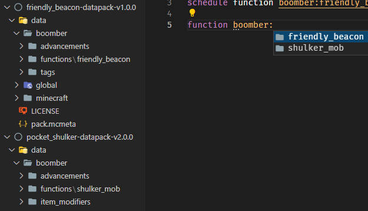

# Namespace Convention (`***`)

## About

This convention aims to prevent conflict when deciding the name for your scoreboards, functions, storages, etc. by using a "namespace prefix".

## Implementation

A namespace prefix must be used whenever it is possible. This includes tags (datapack), tags (`/tag`), nbts, scoreboards, functions, advancements, loot tables, structures, world generation settings, recipes, data storage.

There is no rule specifying how you should design your namespace prefix, but these are some of the examples:

-------------------

```mcfunction
scoreboard objectives add bb.var dummy
team add bb.team
```

In this example, `bb` is the namespace that is shortened from `boomber` due to 16 characters limitation in 1.17 and below.

```mcfunction
scoreboard objectives add boomber.var dummy
team add boomber.team
```

I use the entire `boomber` prefix in this example because scoreboards and teams in 1.18 don't have a character limit.

> `scoreboard trigger` unnecessary use a namespace.
Since it will be exposed to the user, so a nice readable name is quite important. Reviewer can allow it for now considering the benefit of readable trigger name.
>
> `fake_player` as well because it is already inside the  namespace objective. But if you want to keep it clear and organized, you can use full prefix because `fake_player` don't have a character limit. `#boomber.variable_θ bb.data`

-------------------

```mcfunction
tag @s add boomber.foo.bar
```

In this example, I use a full `boomber` prefix, because tags don't have a character limit.

--------------------

```mcfunction
data merge storage boomber:foo/bar {}
```

In this example data storage already has support for namespacing, so I don't need to use a prefix.

--------------------

```mcfunction
give @s diamond{boomber: {custom_data: 123}}
```

In this example, I wrap the `custom_data` nbt inside another tag, allowing it to act as a namespace.

--------------------

The above examples are my style of namespacing, but there are many other approaches that you can take, such as `namespace_foo`, `NAMESPACEfoo`, `namespace.foo`, `namespace:foo` and `namespace/foo`. Your imagination is the limit!

## Note

Using `minecraft` namespace to modify vanilla's behavior is a special case and it is allowed within a reasonable situation.  
However, for example, setting `"replace"` to `true` in the `tick.json` function tag is not a "reasonable situation", because that would prevent other datapacks from working.

--------------------

### **Additional Guideline (Optional)**

**1. Multiple datapacks**

> **Please note:** Namespaces are not recommended as datapack names, which may cause some issues.

**1.1 Datapack Advancement**

- **Cause:** use namespaces as datapack names and follow [3. Datapack Advancement](../conventions/datapack_advancement.md) the advancement *should* be inside `/data/<namespace>/advancements/<datapack name>.json`.
- **Issue:** `/data/<datapack_name>/advancements/<datapack_name>.json`

<div style="margin-left:30px;">

```
data
 ├ <namespace> <- It doesn't make sense to set it as datapack_name.
 │    └ advancements         
 │        └ <datapack_name>.json
 ├ <global>
 │    └ advancements
 │        ├ <namespace>.json <- "This is creator_head" * That's why
 │        └ root.json
```
</div>

- **Solution:** fact it's creator name.
- **Because:** you have more than one datapack under the namespace, it will be very helpful when you work on workspace. 
- **Result:** `<creator_name>:<datapack_name>` prefix is to identify who created it and suffix to tell about datapack. This will be explained further in [Directories guideline](#directories-guideline)

**1.2 Scoreboards and teams:** 1.17 and below

- **Shouldn't:** use shortened prefix as datapack name.
- **Cause:** suppose datapack `Bounce block` uses objective as `bb.var`.
- **Result:** if `bb` is shortened prefix from `boomber`. It can be an issue.
- **Please note:** It is difficult to verify this. This makes it inconvenient for the reviewer, and therefore cannot guarantee that certified datapacks will not cause scoreboard conflicts.

**1.3 Scoreboards and teams:** 1.18 and higher **Tags: 1.13 and higher**

- **Should:** use a full prefix.

**1.4 Storage:** If let me advice, I hope this section will be useful to uninstall.

- **Advice**: `boomber:<datapack_name> bb.<path_storage_name>` 
- **Because:** If you use a prefix, you can remove storage with a single command.  Example: `data remove storage boomber:<datapack_name> bb`. 
- **Standalone datapack:** Example from The Creeper's Code pack is interesting.
`tcc:storage root.<path_storage>`

--------------------

**2. Standalone datapack**

**Note:** Completely free with namespaces.

```
data
 ├ <namespace> <- It make sense to use datapack name.
 │    └ <...>
 ├ <global>
 │    └ advancements
 │        ├ standalone 
 │        │    └ <datapack_node>.json <- "This is datapack node" * That's why completely free.
 │        └ root.json
```

 - **Because:** you have one datapack under the namespace.
 - **Result:** `<project name>:<every_internal_function>`

--------------------

**3. Directories guideline**
> **Guideline Optional**
> - **Standalone datapack:** Completely free, as long as you want to do.
> - **Multiple datapacks:** If possible, I would recommend the following.

**Q:** If I use `creator_name` instead of `datapack_name`. I'm going to have an issue like this
```
"friendly_beacon:main" -> "boomber:main"
"shulker_mob:main" -> "boomber:main"
```
**A:** You can create `sub-folders` inside `functions` folder.

```
boomber/functions/friendly_beacon/
boomber/functions/shulker_mob/

"friendly_beacon:main" -> "boomber:friendly_beacon/main"
"shulker_mob:main" -> "boomber:shulker_mob/main"

If you want an example guideline, I have it.

data
 ├ <your_name>
 │    ├ advancements
 │    │   ├ <datapack_name>
 │    │   │   ├ <event>
 │    │   │   │   └ <player_hurt_entity>.json
 │    │   │   ├ <place>
 │    │   │   │   └ <place_block>.json
 │    │   │   └ <folder advancement groups>
 │    │   └ <datapack_name>.json
 │    ├ functions
 │    │   ├ <datapack_name>
 │    │   │   ├ <folder function groups>
 │    │   │   ├ main.mcfunction or tick.mcfunction
 │    │   │   ├ setup.mcfunction or init.mcfunction
 │    │   │   └ uninstall.function
 │    │   └ <database, random & etc.>
 │    ├ loot_tables
 │    │   └ <datapack_name>
 │    │       └ <loot folder groups item, block>
 │    │           └ <...>.json
 │    ├ predicates
 │    │   └ <datapack_name>
 │    │       ├ <folder predicate groups>
 │    │       └ <...>.json
 │    ├ recipes
 │    │   └ <datapack_name>
 │    │       └ <...>.json
 │    └ tags
 │        └  <items>
 │            └ <datapack_name>
 │                └ <...>.json
 ├ <global>
 │    └ advancements
 │        ├ <your_name>.json
 │        └ root.json
 └ <minecraft>
 ```

**4. More facts from the perspective of convention mod**


In datapacker circles, there are identical datapacks created by different datapackers, with the same functionality. (with different command's algorithm in different datapacker methods, but with the same result) and may be slightly different, according to the functionality and design features. 
> Example cool stuff datapack here
> - [Veinminer by Boomber](https://www.planetminecraft.com/data-pack/veinminer-by-boomber/)
> - [VeinMiner by Gnottero](https://www.planetminecraft.com/data-pack/javd-just-another-veinminer-datapack/)
> - [Vein Miner Unified by Elemend](https://github.com/Elemend/Vein-Miner-Unified)

For example, the veinminer datapack, if you use a namespace is `vm` and other datapackers use too, it's an issue.
And not explicitly identify under the datapacker's name. Because it was not grouped or class directly under datapacker's name, which lacks flexibility and easy maintenance. 

**Note:** But this is not disallowing you to use namespace as datapack name.

```
Fictitious directory example:

data veinminer:main
 ├ veinminer
 ├ <global>
 │    └ advancements
 │        └ convention.json

data - villager_magic:main
 ├ villager_magic
 ├ <global>
 │    └ advancements
 │        └ convention.json

data - veinminer_faq:tick
 ├ veinminer_faq
 ├ <global>
 │    └ advancements
 │        └ faq.json

data - vm:tick
 ├ vm (Virtual Magic)
 ├ <global>
 │    └ advancements
 │        └ faq.json
```
```mcfunction
function veinminer:main
function villager_magic:main
function veinminer_faq:tick
function vm:tick
```
**Or**
```
data - convention:veinminer/main
 ├ convention
 │    └ functions
 │        └ veinminer
 ├ <global>
 │    └ advancements
 │        └ convention.json

data - convention:villager_magic/main
 ├ convention
 │    └ functions
 │        └ villager_magic
 ├ <global>
 │    └ advancements
 │        └ convention.json

 data - faq:veinminer/tick
 ├ faq
 │    └ functions
 │        └ veinminer
 ├ <global>
 │    └ advancements
 │        └ faq.json

data - faq:virtual_magic/tick
 ├ faq
 │    └ functions
 │        └ virtual_magic
 ├ <global>
 │    └ advancements
 │        └ faq.json

```
```mcfunction
function convention:veinminer/main
function convention:villager_magic/main
function faq:veinminer/tick
function faq:virtual_magic/tick
```
But from the above example, which one do you think looks better? Here, I think it's better to let the user see both the creator name and the datapack name when typing the `/function` command. Instead of just the datapack name.
I hope this helpful to you in datapacking.